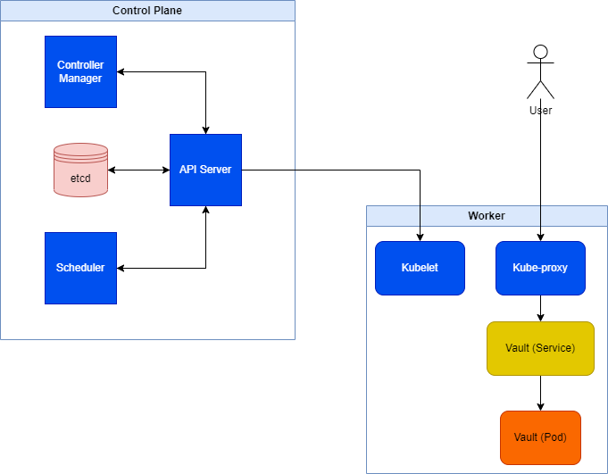

## Заголовчная информация
University: [ITMO University](https://itmo.ru/ru/)\
Faculty: [FICT](https://fict.itmo.ru)\
Course: [Introduction to distributed technologies](https://github.com/itmo-ict-faculty/introduction-to-distributed-technologies)\
Year: 2023/2024\
Group: K4111c\
Author: Nikitin Alexander Konstantinovich\
Lab: Lab1\
Date of create: 19.11.2023\
Date of finished:
## Содержание
### Ход работы
Первым шагом работы была установка *Docker Engine* в качестве инструмента для развертывания виртуальных контейнеров и *Minicube* для развертывания *Kubernetes*-кластера.\
Затем был выгружен [образ контейнера](https://hub.docker.com/_/vault) программного обеспечения [Vault by HashiCorp](https://www.vaultproject.io/) и составлен файл манифеста для развертывания пода (см. *vault.yaml*).\
Далее в *командной строке Windows* был выполнен следующий набор команд:

1. `minicube start`
> Запуск кластера *Kubernetes*;

2. `kubectl apply -f vault.yaml`
> Развертывание пода *vault* с помощью манифеста;

3. `kubectl get pods`
> Проверка работоспособности пода (Status: **RUNNING**) в *namespace*, заданном по умолчанию;

4. `kubectl expose pod vault --type=NodePort --port=8080 --target-port=8200`
> Создание сервиса на основе пода с открытым портом 8080;

5. `kubectl get services`
> Проверка появления нового сервиса *vaults* в *default namespace*, заданном по умолчанию;

6. `kubectl port-forward service/vault 8080:8080`
> Привязка порта публичного IP (***0.0.0.0:8080***) к локальному (***127.0.0.1:8080***);

7. `kubectl logs vault`
> Вывод на консоль  *stdout* пода *vaults* для получения *токена авторизации*;

8. `minikube stop`
> Остановка кластера *Kubernetes*.
### Результаты
**Главная страница сайта**

**Диаграмма организации контейнеров**
