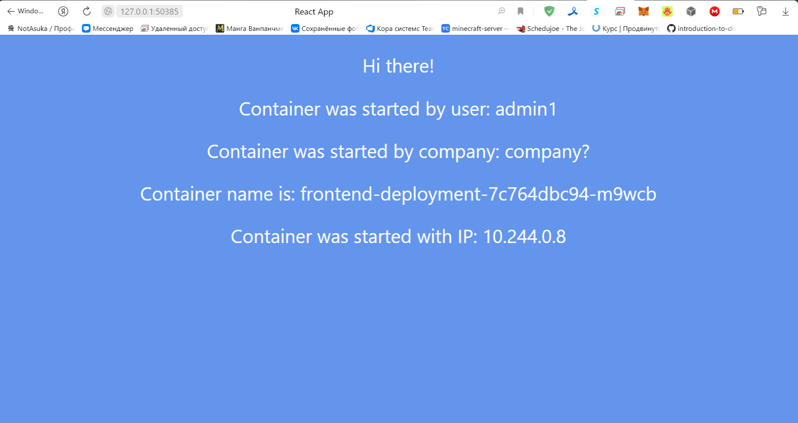
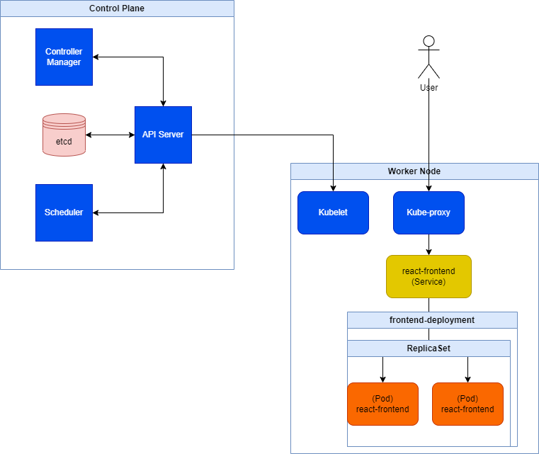

## Заголовчная информация
University: [ITMO University](https://itmo.ru/ru/)\
Faculty: [FICT](https://fict.itmo.ru)\
Course: [Introduction to distributed technologies](https://github.com/itmo-ict-faculty/introduction-to-distributed-technologies)\
Year: 2023/2024\
Group: K4111c\
Author: Nikitin Alexander Konstantinovich\
Lab: Lab1\
Date of create: 24.11.2023\
Date of finished: 
## Содержание
### Ход работы
.yaml-файл с **Deployment** прикреплен в репозитории.

1. `minicube start`
> Запуск кластера *Kubernetes*;

2. `kubectl apply -f frontend.yaml`
> Развертывание **Deployment** *frontend-deployment* с помощью манифеста;

3. `kubectl get pods`
> Проверка создания подов после развертывания **Deployment**. Так как в файле манифеста было указано две реплики, получили два работающих пода;

4. `kubectl expose deployment frontend-deployment --type=LoadBalancer --port=8080 --target-port=3000`
> Создание сервиса к **Deployment** *frontend-deployment* (к двум его подам) с открытым портом 8080;

5. `kubectl get services`
> Проверка появления нового сервиса *frontend-deployment*;

6. `minikube tunnel`
> Пробрасываем порты к localhost для всех наших сервисов типа **LoadBalancer** (в данном случае сервис один).\
> Приложение теперь доступно по пути http://127.0.0.1:8080/;
 
7. Можно заметить, что при обновлении страницы с очисткой кэша (CTRL + F5) переменные окружения `REACT_APP_USERNAME` и `REACT_APP_COMPANY_NAME` не изменяются, так были однозначно заданы нами в манифесте и не подвергаются никаким изменениям извне.\
В то же время значения `Container Name` и `Container IP` имеют тенденцию изменяться. Это связано с распределением нагрузки по двум созданным нами репликам подов, имеющих разные имена и внутренние IP внутри ноды.

8. `kubectl logs <container-name>`
> Вывод на консоль  содержимого *stdout* двух реплик подов;

9. Содержимое обоих логов практически идентично и представлено ниже.
> Builing frontend\
build finished\
Browserslist: caniuse-lite is outdated. Please run:\
  npx update-browserslist-db@latest\
  Why you should do it regularly: https://github.com/browserslist/update-db#readme \
Browserslist: caniuse-lite is outdated. Please run:\
  npx update-browserslist-db@latest\
  Why you should do it regularly: https://github.com/browserslist/update-db#readme \
Server started on port 3000

9. `minikube stop`
> Остановка кластера *Kubernetes*.
### Результаты
**Главная страница сайта**

**Диаграмма контейнеров**
