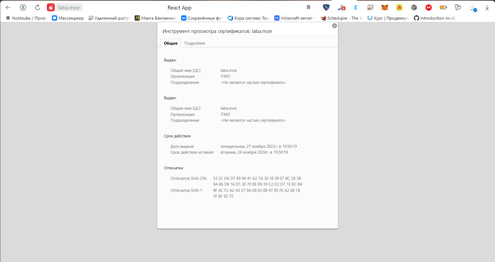
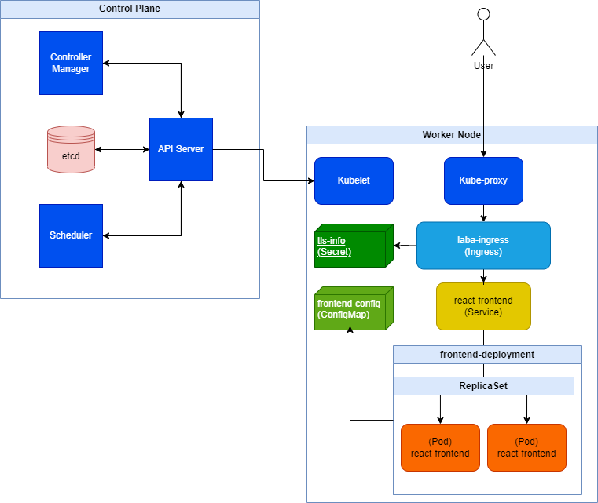

## Заголовчная информация
University: [ITMO University](https://itmo.ru/ru/)\
Faculty: [FICT](https://fict.itmo.ru)\
Course: [Introduction to distributed technologies](https://github.com/itmo-ict-faculty/introduction-to-distributed-technologies)\
Year: 2023/2024\
Group: K4111c\
Author: Nikitin Alexander Konstantinovich\
Lab: Lab3\
Date of create: 27.11.2023\
Date of finished: 
## Содержание
### Ход работы
.yaml-файл с **Deployment**, **ConfigMap**, **Ingress** прикреплены в репозитории.\
Используемая операционная система: *Windows*. 

1. `minicube start`
> Запуск кластера *Kubernetes*;

2. `kubectl apply -f config.yaml`
> Создание конфигурационного файла **ConfigMap** *frontend-config*, хранящего переменные окружения, с помощью  манифеста;

3. `kubectl apply -f frontend.yaml`
> Развертывание **Deployment** *frontend-deployment* с помощью манифеста;

4. `kubectl expose deployment frontend-deployment --type=LoadBalancer --port=8080 --target-port=3000`
> Создание сервиса к **Deployment** *frontend-deployment* (к двум его подам) с открытым портом 8080;

5. `openssl req -x509 -newkey rsa:4096 -sha256 -nodes -keyout tls.key -out tls.crt -days 365`
> Данная команда была выполнена в среде **Cygwin**. Она создает *TLS-сертификат* и *ключ* к нему.\
> При исполнении команды также была заполнена метаинформация сертификата. Сгенерированные файлы были перемещены в корневую директорию проекта.

6. `kubectl create secret tls tls-info --cert=tls.crt --key=tls.key`
> Создание конфигурационного файла **Secret** *tls-info*, хранящего закодированную информацию SSL-сертификата (кодировка *sha256*).

7. `minikube addons enable ingress`
> Данная команду активирует аддон *ingress* в *minikube*.

8. `kubectl apply -f ingress.yaml`
> Создание **Ingress** *laba-ingress* к сервису *frontend-deployment*, являющего из себя единую точку входа для всех сервисов (в нашем случае одного сервиса), по доменному имени https://laba.moe.;

9. Обновляем DNS устройства, на котором запущен кластер *Kubernetes*, добавив в файл `C:\Windows\System32\drivers\etc\hosts` строчку `127.0.0.1 laba.moe`

10. `minikube tunnel`
> Пробрасываем порты к localhost для всех наших сервисов и *Ingress*.\
> Приложение теперь доступно по пути http://127.0.0.1:8080/ и https://laba.moe соответственно;

11. `minikube stop`
> Остановка кластера *Kubernetes*.
### Результаты
**Данные TLS-сертификата**

**Диаграмма организации контейнеров**
