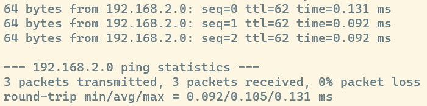
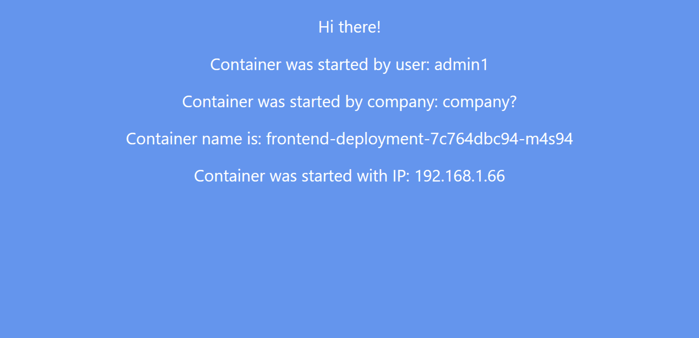
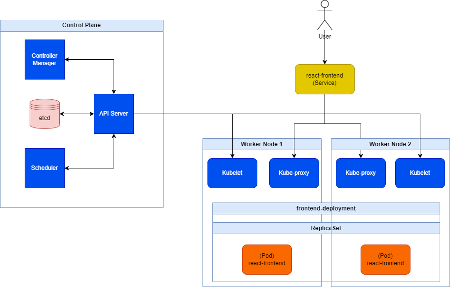

## Заголовчная информация
University: [ITMO University](https://itmo.ru/ru/)\
Faculty: [FICT](https://fict.itmo.ru)\
Course: [Introduction to distributed technologies](https://github.com/itmo-ict-faculty/introduction-to-distributed-technologies)\
Year: 2023/2024\
Group: K4111c\
Author: Nikitin Alexander Konstantinovich\
Lab: Lab4\
Date of create: 02.11.2023\
Date of finished: 
## Содержание
### Ход работы
.yaml-файлы с **Deployment** и **IPPool** прикреплены в репозитории.\
Операционная система: **Windows**. Файл с конфигурацией *Calico* нужен для корректной работы на целевой ОС.

1. `minicube start -n 2 --network-plugin=cni --cni=calico`
> Запуск кластера *Kubernetes* с двумя ***worker-нодами*** и выбранным ***cni*** *Calico*;

2. `kubectl get nodes`
> Проверка создания новых нод в кластере. Нод действительно теперь две: `minikube` и `minikube-m02`.

3. `kubectl get pods -l k8s-app=calico-node -A`
> Проверка функцинирования *Calico*. Получаем два работающих пода, то есть *Calico* успешно запущен и работает.

4. `kubectl label nodes minikube group=group1`\
`kubectl label nodes minikube-m02 group=group1`
> Ставим нодам метки для дальнейшей работы *селекторов*. В данном случае каждой из двух нод приписывается новая метка.

5. `calicoctl delete ippools default-ipv4-ippool --config=calico.config.yaml --allow-version-mismatch`
> Удаление пула IP, созданного по умолчанию и общему для всех нод.

6. `calicoctl create -f ippool.yaml --config=calico.config.yaml --allow-version-mismatch`
> Создание двух собственных **IPPool**, приписанных через *labelSelector* к соответствующей ноде.

7. `kubectl apply -f frontend.yaml`
> Развертывание **Deployment** *frontend-deployment* с помощью манифеста и создание двух реплик подов, автоматически распределенных по свободным нодам;

8. `kubectl expose deployment frontend-deployment --type=LoadBalancer --port=8080 --target-port=3000`
> Создание сервиса к **Deployment** *frontend-deployment* (к двум его подам) с открытым портом 8080;

9. `minikube tunnel`
> Пробрасываем порты к localhost для всех наших сервисов типа **LoadBalancer** (в данном случае сервис один).\
> Приложение теперь доступно по пути http://127.0.0.1:8080/;
 
10. Можно заметить, что при обновлении страницы с очисткой кэша (CTRL + F5) переменные окружения `REACT_APP_USERNAME` и `REACT_APP_COMPANY_NAME` не изменяются, так были однозначно заданы нами в манифесте и не подвергаются никаким изменениям извне.\
В то же время значения `Container Name` и `Container IP` имеют тенденцию изменяться, при этом значения `Container IP` соответствуют *cidr* из **IPPool**. Это связано с распределением нагрузки по двум созданным нами репликам подов, имеющих разные имена и внутренние IP внутри нод.

11. Возможные значения `Container IP`, отображенные на сайте: **192.168.1.66** у *frontend-deployment-7c764dbc94-m4s94* и **192.168.2.0** у *frontend-deployment-7c764dbc94-zwrwr*. \
Очевидно, они являются IP-адресами подов, к которым идет запрос. Прокинем внутренний запрос из одного пода в другой при помощи команды `ping`.

12. `kubectl exec frontend-deployment-7c764dbc94-m4s94 -- ping 192.168.2.0 -c 3`

Как можно заметить, под первой ноды смог без проблем обратиться к поду второй ноды.

13. `minikube stop`
> Остановка кластера *Kubernetes*.
### Результаты
**Главная страница сайта**

**Диаграмма организации контейнеров**
